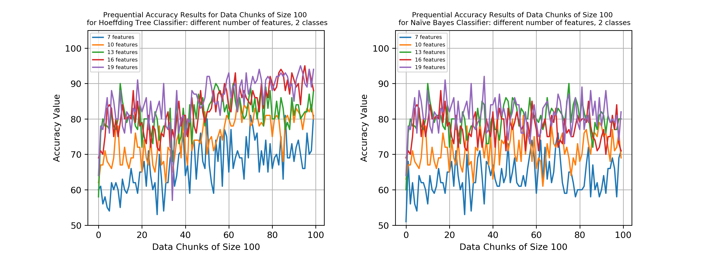

# Online Data Stream Classification by using MOA

This repository belongs to the Assignment #3 of CS533 Informal Retrieval Systems Course, Fall 2019, Bilkent University.

In this project, Hoeffding Tree and Naive Bayes classifiers are constructed to perform online data stream classification. The effect of the numbers of features & classes are observed and visualized in some controlled experiments.


## Dataset
The dataset used in this study is generated by using ```RandomRBFGenerator``` from MOA and includes 10,000 data instances. In order to observe the effect of number of features & classes, different datasets are generated for each case.  
The number of features refers to the amount of data instances within a single stream. On the other hand, the number of classes refers how many different class labels are available in the dataset.


## Evaluation
In this task, a very popular evaluation scheme among the data stream applications, _prequential_ or _interleaved-test-then-train_ evaluation method is used. The idea is that each data instance is first used to test the model, and then to train the model. This approach makes it possible to observe the success of the model as more data instances are processed.


## Classifiers

The classifiers are constructed simply by using MOA implementations.
```java
import moa.classifiers.trees.HoeffdingTree;
import moa.classifiers.bayes.NaiveBayes;

Classifier learnerHoeffding = new HoeffdingTree();
Classifier learnerBayes = new NaiveBayes();
``` 
Then, I created a method to evalute these classifiers within the class [moaObject](./src/moaObject.java).


## Observing the Effect of Number of Features

A controlled experiment setup is used for this purpose such that the number of classes is kept constant (2, binary classification) and the number of data instances is kept as 10,000.

By selecting the number of features as different values, the accuracy results for Hoeffding Tree and Naive Bayes Classifiers are visualized in 2 different ways:

#### 1) Cumulative Accuracy:
In order to calculate the cumulative accuracy, the number of correctly predicted instances is divided to the total number of instances examined until that point. In the earlier steps, the accuracy value is low, as expected due to the small number of training instances. However, the model starts to make more accurate predictions as it is trained by more and more data instances. The cumulative accuracy results for different number of features in data are visualized in Figure 1.


Figure 1. Cumulative Accuracy Results of HT and NB classifiers with different number of features and 2 classes

#### 2) Prequential Accuracy:  
Although the cumulative accuracy plot gives an idea for the evaluation of the model prediction success, it does not show the correct accuracy values of temporal regions. For example, consider the accuracy value calculated in the 1000th data instance. 

This value would be seriously affected by the first accuracy values (e.g. first 100 instances) which are too low due to the lack of training. To mitigate this problem, the whole dataset of 10000 samples is split into 100 chunks consisting of 100 data instances each. Then the average accuracy value for each chunk is calculated so that each chunk can be evaluated independently. The graphs of prequential accuracy values of 100 data chunks for both classifiers are given in Figure 2.


Figure 2. Prequential Accuracy Results (100 chunks consisting of 100 data instances each) of HT and NB classifiers with different number of features and 2 classes

## Observing the Effect of Number of Classes

Similar to the process completed in the previous step, cumulative and prequential accuracy results are illustrated for different number of classes (fixed feature number: 10) in Figure 3 and 4, respectively.


Figure 3. Cumulative Accuracy Results of HT and NB classifiers with different number of classes and 10 features


Figure 4. Prequential Accuracy Results (100 chunks consisting of 100 data instances each) of HT and NB classifiers with different number of classes and 10 features


For more technical details and a non-systematic literature survey on data stream classification, check [my report](./doc/report.pdf).
